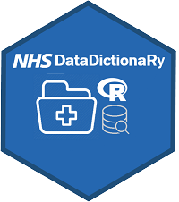

# NHSDataDictionaRy webinar


<a href ="https://github.com/StatsGary/NHSDataDictionaRy"></a>
<br></br>


This webinar was designed to build an understanding of how to use the NHSDataDictionaRy package and what it does. I will take you through the functionality and how to utilise it in this webinar. The webinar will also be made available on the NHS-R community website and YouTube channels. I would like to thank the team at [NHS-R community](https://nhsrcommunity.com/) for allowing me time to develop this package. 

## Installing the package
The most recent version of the package is on GitHub:

``` r
#install.packages("remotes")
remotes::install_github("https://github.com/StatsGary/NHSDataDictionaRy")

```

The package will get uploaded to CRAN again in May - once all the changes have been finalised. 

## What's in the webinar

I will show how to code out the issues in the webinar and take you through step by step how to use the package. This webinar will include:

- What is the package and the benefits of using the package
- What was the motivation for the package
- How to use the package
- Where to get the supporting guidance for the package

This guidance can also be found in the next section.

## Learn how to use it
The official vignette shows how to use the  [package](https://rdrr.io/cran/NHSDataDictionaRy/f/vignettes/introduction.Rmd).

The supporting html document for the actual webinar can be sourced from the GitHub repo, which supports this training: [GitHub repository tutorial](https://hutsons-hacks.info/wp-content/uploads/2021/04/NHSDataDictionary_howto.html).

## Signing off and stay posted
If you have enjoyed this webinar then please drop me a line at [@StatsGary](https://twitter.com/StatsGary). 

I am currently working as the Head of Advanced Analytics for [Arden and Greater East Midlands CSU](https://www.ardengemcsu.nhs.uk/) and I would be happy to take any questions via email: <g.hutson@nhs.net>.

<a href="https://nhsrcommunity.com/"></a>
<a href="https://www.ardengemcsu.nhs.uk/"></a>


